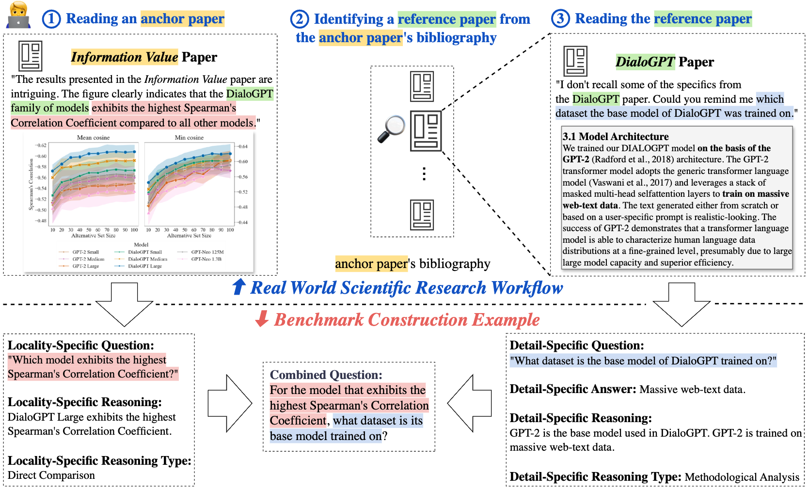

# 🧑‍🔬 M3SciQA

🏠[Home](https://) | 🤗[Data](https://huggingface.co/)

This repositary contains codes to evaluate models on M3SciQA from the paper [M3SciQA: A Multi-Modal Multi-Document Scientific Benchmark for Evaluating Foundation Models](https://)

## 👋 Introduction
In the realm of foundation models for scientific research, current benchmarks predominantly focus on single-document, text-only tasks and fail to adequately represent the complex workflow of such research. These benchmarks lack the $\textit{multi-modal}$, $\textit{multi-document}$ nature of scientific research, where comprehension also arises from interpreting non-textual data, such as figures and tables, and gathering information across multiple documents. To address this issue, we introduce M3SciQA, a Multi-Modal, Multi-document Scientific Question Answering benchmark designed for a more comprehensive evaluation of foundation models. M3SciQA consists of 1,452 expert-annotated questions spanning 70 natural language processing (NLP) papers clusters, where each cluster represents a primary paper along with all its cited documents, mirroring the workflow of comprehending a single paper by requiring multi-modal and multi-document data. With M3SciQA, we conduct a comprehensive evaluation of 18 prominent foundation models. Our results indicate that current foundation models still significantly underperform compared to human experts in multi-modal information retrieval and in reasoning across multiple scientific documents. Additionally, we explore the implications of these findings for the development of future foundation models. 




## Setup 
```bash
git clone https://github.com/yale-nlp/M3SciQA
cd M3SciQA
```

<details>
<summary>Tour for the code base</summary>

```
.
├── data/
│   ├── locality.jsonl
│   ├── combined_test.jsonl
│   ├── combined_val.jsonl
│   ├── locality/
|   |   ├── 2310.04988
|   |       └── HVI_figure.png
|   |   ├── 2310.05030
|   |       └── diversity_score.png
|   |   ...
├── src/
│   ├── data_utils.py
│   ├── evaluate_detail.py
│   ├── evaluate_locality.py
│   ├── generate_detail.py
│   ├── generate_locality.py
│   ├── models_w_vision.py
│   ├── models_wo_vision.py
│   ├── README.md
├── results/
│   ├── locality_response/
│   ├── retrieval@1/
│   ├── retrieval@2/
│   ├── retrieval@3/
│   ├── retrieval@4/
│   ├── retrieval@5/
├── paper_cluster_S2_content.json
├── paper_cluster_S2.json
├── paper_full_content.json
├── retrieval_paper.json
├── README.md
└── .gitignore
```

- `data` folder contains locality-specific questions, combined question validation, and combined question test. Answers, explanations, and evidence for the test split are set to `null` to prevent testing data from leaking to the public. 
- `data/locality/` folder contains all images used to compose locality-specific questions. 
- `results/` contains evaluation results under different settings.
- `src/generate_locality.py`: script for generating responses for locality-specific questions.
- `src/evaluate_locality.py`: script for evaluating responses for locality-specific questions.
- `src/generate_detail.py`: script for generating responses for detail-specific questions.
- `src/evaluate_detail.py`: script for evaluating responses for detail-specific questions.
- For locality reasoning types, we use the mapping:
```js
{
    "1": Comparison
    "2": Data Extraction 
    "3": Location
    "4": Visual Understanding
}
```
</details>

## Locality-Specific Question Evaluation
### Output Format
```js
{
    "question_anchor": ... <str>, 
    "reference_arxiv_id": ... <str>, 
    "reference_s2_id": ... <str>, 
    "response": ... <str>
}
```
- `response` field contains model's output ranking.

For example, 
```js
{"question_anchor": "Which large language model achieves a lower HVI score than OPT but a higher HVI score than Alpaca?", 

"reference_arxiv_id": "2303.08774", 

"reference_s2_id": "163b4d6a79a5b19af88b8585456363340d9efd04", 

"response": "```json\n{\"ranking\":             
        [\"1827dd28ef866eaeb929ddf4bcfa492880aba4c7\", \"57e849d0de13ed5f91d086936296721d4ff75a75\", \"2b2591c151efc43e8836a5a6d17e44c04bb68260\", \"62b322b0bead56d6a252a2e24de499ea8385ad7f\", \"964bd39b546f0f6625ff3b9ef1083f797807ef2e\", \"597d9134ffc53d9c3ba58368d12a3e4d24893bf0\"
        ]}```"}
```

### Locality-Specific Question Response Generation
For example, to evaluate GPT-4o, run the following command:
```bash
cd src 
python generate_locality.py 
    --model gpt_4_o
```

For open-source models, we provide the code for `Qwen2 VL 7B`. You can modify this function to be suitable for other models. To run it, you need go to the root folder and create a folder named `pretrained`. If you are in the `src/` folder:

```
cd ..
mkdir pretrained && cd src
python generate_locality.py --model qwen2vl_7b
```

### Locality-Specific Question Response Evaluation
Similarly, to calculate the MRR, NDCG@3, and Recall@3 of GPT-4o, run the following command:
```bash
python evaluate_locality.py  
    --result_path ../results/locality_response/gpt_4_o.jsonl 
    --k 3
```

## Detail-Specific Question Evaluation

### Output Format 
```js
{
    "question": ... <str>, 
    "answer": ... <str>, 
    "response": ... <str>, 
    "reference_reasoning_type": ... <str>
}
```
### Detail-Specific Question Response Generation
Parameters:
- `model`: model that you want to evaluate
- `k`: number of papers that you want to retrieve from the re-ranked paper list
- `chunk_length`: chunk length that you want to pass into the model for models with short context length

For evaluating open-source models, we offer two methods: (1) using [TogetherAI API](https://api.together.xyz/signin) and (2) caccessing models directly from Hugging Face. 
Currently, local execution is supported only for `Qwen2vl 7B`, but you can easily modify the function to work with any other LLMs available on Hugging Face.

For example, to use GPT-4 with $k=3$ and $chunk\_length = 15000$ for generating responses, run the following command:
```bash
cd src
python generate_detail.py 
    --model gpt_4 
    --k 3 
    --chunk_length 15000
```


### Detail-Specific Question Evaluation:
To evaluate GPT-4's generated response, run the following command:

```bash
python evaluate_detail.py 
    --result_path ../results/retrieval@3/gpt_4.jsonl
```
